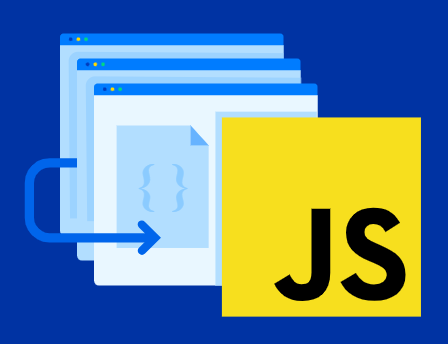

# Files from http-5122
## Front-End Web Development
## Course Code: HTTP 5122

### Academic Year: 2025-2026

This course delivers the fundamentals of computer programming and introduces the tools for creating interactive web pages using the JavaScript programming language.

# Links
https://www.w3schools.com/js/default.asp

# Images

***Important Notice:*** This repository contains my weekly work for this course. It is recommended to practice regularly with JavaScript to enhance your coding skills and confidence.
